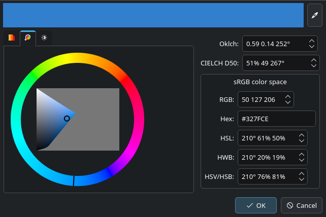

<!--
SPDX-FileCopyrightText: Lukas Sommer <sommerluk@gmail.com>
SPDX-License-Identifier: BSD-2-Clause OR MIT
-->

<!-- NOTE This file serves at the same time as description on Github and as
main page for Doxygen documentation. -->

# PerceptualColor

This library provides Qt GUI components for choosing colors, with
focus on an intuitive and perceptually uniform presentation. The GUI
widgets are based internally on the LCH color model, which does reflect
the human perception much better than RGB or its transforms like HSV.
However, the widgets do not require the user itself to know anything
about LCH at all, because the graphical representations is
intuitive enough.

This library…

- … provides a complete documentation for the public API (and also for
    the internal API and for source code itself).
- … is cross-platform. It does not use platform-specific code nor
    relies on a specific byte order.
- … provides internationalization and localization including right-to-left
    layouts.
- … provides high-DPI support.
- … uses QStyle wherever possible.
- … provides support for Qt style sheets where is makes sense.
- … has support for both, pointer device (mouse, touchpad…) *and*
    keyboard navigation, in the widgets.
- … has a permissive license.
- … can be built as either a static or a shared/dynamic library.
- … has basic support for accessibility.
- … is developed with unit tests.
- … links only to Qt and LittleCMS, so being Tier 1.
<!-- (ColorDialog’s screen color picker feature depends on Qt’s internals.)
- … uses only the public API of Qt and LittleCMS, and no private
    features of these libraries.
-->

Useful links:

- [Online API documentation](https://api.kde.org/perceptualcolor/html/index.html)
- [GIT Repository on invent.kde.org](https://invent.kde.org/libraries/perceptualcolor)
