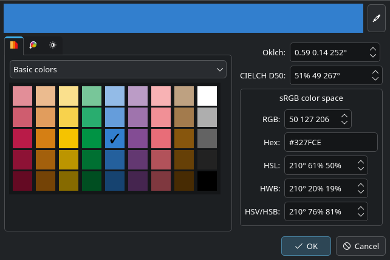
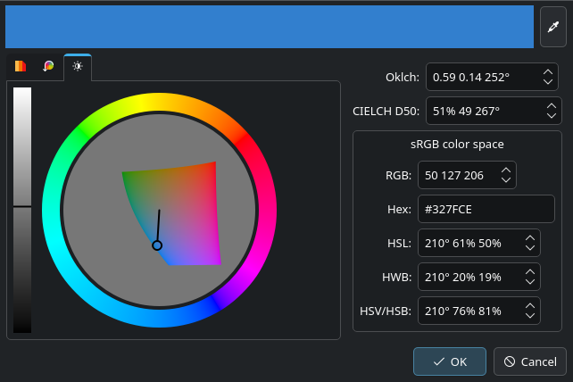

<!--
SPDX-FileCopyrightText: Lukas Sommer <sommerluk@gmail.com>
SPDX-License-Identifier: BSD-2-Clause OR MIT
-->

<!--
NOTE This file serves at the same time as description
on Github and as main page for Doxygen documentation. See
https://community.kde.org/Frameworks/Frameworks_Documentation_Policy#README.md
for recommended document style.
-->

# PerceptualColor

This library provides Qt GUI components for choosing colors, with a
focus on an intuitive and perceptually uniform presentation.

## Introduction

The GUI widgets in PerceptualColor are based on the LCH color model, which
is known to reflect human perception better than RGB or its variants like
HSV.  This leads to a highly intuitive user interface that is more
user-friendly and easier to navigate. Moreover, the widgets can be used
effectively without any prerequisite knowledge of the LCH color model
by the users.

## Features

This library:

- Provides complete documentation for the public API (as well as for the
  internal API and source code itself).
- Is cross-platform. It does not use platform-specific code nor rely on a
  specific byte order.
- Provides internationalization and localization, including right-to-left
  layouts.
- Provides high-DPI support.
- Uses QStyle wherever possible.
- Provides support for Qt style sheets where it makes sense.
- Has support for both pointer devices (mouse, touchpad, etc.) *and*
  keyboard navigation in the widgets.
- Has a permissive license.
- Can be built as either a static or a shared/dynamic library.
- Has basic support for accessibility.
- Is developed with unit tests.
- Links only to Qt and LittleCMS, making it a Tier 1 library.
<!-- (ColorDialog’s screen color picker feature depends on Qt’s internals.)
- Uses only the public API of Qt and LittleCMS, and no private
  features of these libraries.
-->

## Links

- [Online API documentation](https://api.kde.org/perceptualcolor/html/index.html)
- [GIT Repository on invent.kde.org](https://invent.kde.org/libraries/perceptualcolor)
